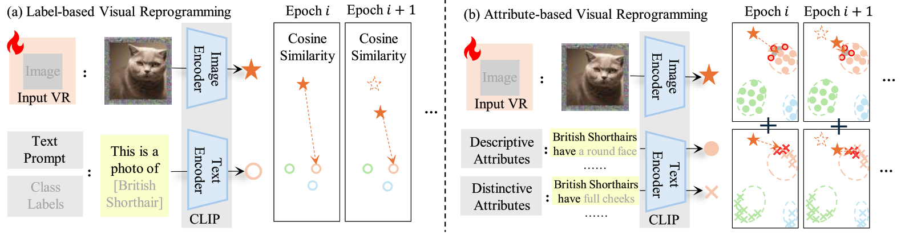

# Attribute-based Visual Reprogramming for Vision-Language Models

 

This repository is the official PyTorch implementation of the **ICLR 2025** paper:
[Attribute-based Visual Reprogramming for Vision-Language Models](https://openreview.net/forum?id=j964C6y92q),
authored by Chengyi Cai, Zesheng Ye, Lei Feng, Jianzhong Qi, and Feng Liu.

**Abstract:**
*Visual reprogramming* (VR) reuses pre-trained vision models for downstream image classification tasks by adding trainable noise patterns to inputs.
When applied to vision-language models (e.g., CLIP), existing VR approaches follow the same pipeline used in vision models (e.g., ResNet, ViT), where ground-truth class labels are inserted into fixed text templates to guide the optimization of VR patterns.
This label-based approach, however, overlooks the rich information and diverse attribute-guided textual representations that CLIP can exploit, which may lead to the misclassification of samples. 
In this paper, we propose ***Attr**ibute-based **V**isual **R**eprogramming* (AttrVR) for CLIP, utilizing ***des**criptive **attr**ibutes* (DesAttrs) and ***dist**inctive **attr**ibutes* (DistAttrs), which respectively represent common and unique feature descriptions for different classes.
Besides, as images of the same class may reflect different attributes after VR, AttrVR iteratively refines patterns using the *k*-nearest DesAttrs and DistAttrs for each image sample, enabling more dynamic and sample-specific optimization. 
Theoretically, AttrVR is shown to reduce intra-class variance and increase inter-class separation. Empirically, it achieves superior performance in 12 downstream tasks for both ViT-based and ResNet-based CLIP. The success of AttrVR facilitates more effective integration of VR from unimodal vision models into vision-language models.

## Environment

- Python (3.10.0)
- PyTorch (2.0.1) 
- TorchVision (0.15.2)

## Installation
    conda create -n reprogram
    conda activate reprogram
    pip install -r requirement.txt

## Dataset Preparation
To implement the results, please follow [CoOp](https://github.com/KaiyangZhou/CoOp/blob/main/DATASETS.md#how-to-install-datasets) to download the datasets and modify `DOWNSTREAM_PATH = ""` in `cfg.py` of this repository. Resisc45 can be prepared following [BlackVIP](https://github.com/changdaeoh/BlackVIP).

## Step 1: Generating DesAttr and DistAttr / Use the Generated Attributes
 - We have uploaded all generated attributes used in this paper to `attributes/gpt3`. Other attributes used in Appendix C.7 & C.9 generated by other LLMs/MLLMs can also be found in `attributes/...`.

 - If you would like to generate the attributes by yourself, please first enter your API Key in `generate_attributes.py`, then run the code `python generated_attributes.py`.

## Step 2.1: Running Code for Baselines
    
    python experiments/fs_vp.py --dataset [dataset]
    python experiments/fs_ar.py --dataset [dataset]

## Step 2.2: Running Code for AttrVR

    python experiments/fs_attrvr.py --dataset [dataset]

## Acknowledgements

This repo is built upon these previous works:

- [OPTML-Group/ILM-VP](https://github.com/OPTML-Group/ILM-VP)
- [CoOp & CoCoOp](https://github.com/KaiyangZhou/CoOp)
- [CuPL](https://github.com/sarahpratt/CuPL/tree/main)
- [tmlr-group/SMM](https://github.com/tmlr-group/SMM)
- [tmlr-group/BayesianLM](https://github.com/tmlr-group/BayesianLM)

## Citation
    
    @inproceedings{cai2025attribute,
        title={Attribute-based Visual Reprogramming for Image Classification with CLIP},
        author={Chengyi Cai and Zesheng Ye and Lei Feng and Jianzhong Qi and Feng Liu},
        booktitle = {International Conference on Learning Representations},
        year={2025}
    }
